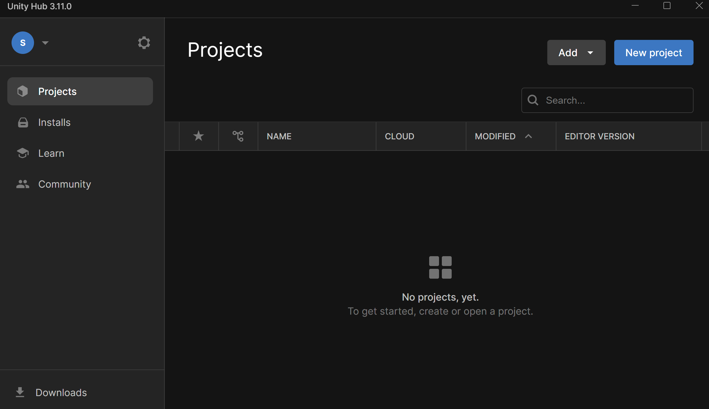
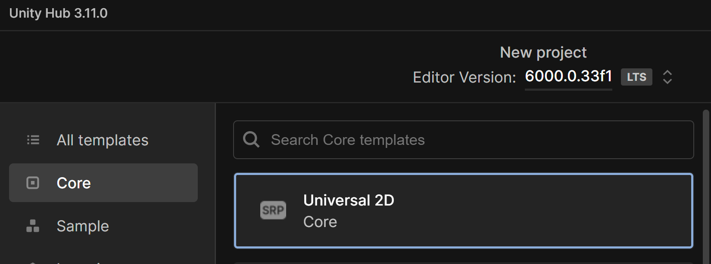
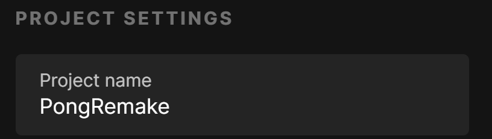
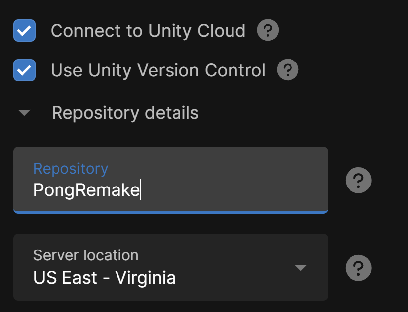
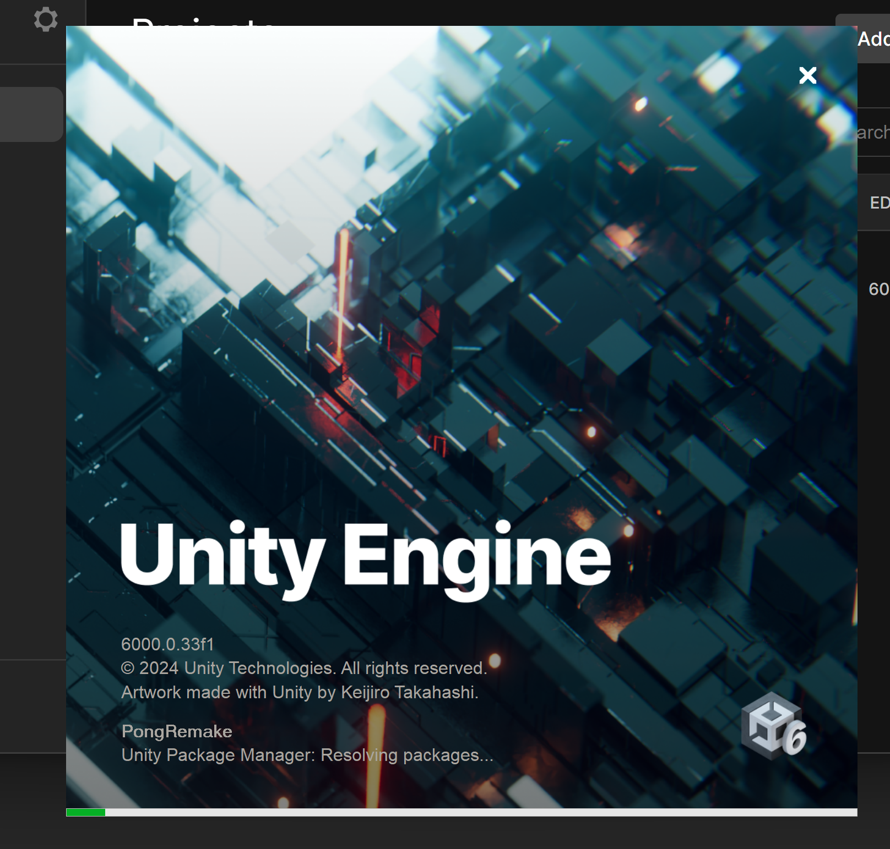

# Create A New Project
***

Open Unity Hub and create a new project by click on the "New Project" button.

We're going to use the Universal 2D template.

## Project Settings
***

* Under project settings, give your project an appropriate name. I chose "PongRemake".

* Scroll down and check "Connect to Unity Cloud" and "Use Unity Version Control".
    * The repository name will be autofilled in with your project name.

* Click Create Project

Now just wait a bit for Unity to compile and create the needed resources for your new project.

---
>Next: [What Makes A Game?](/02_What/WHAT.md)
