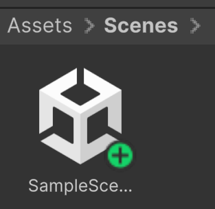
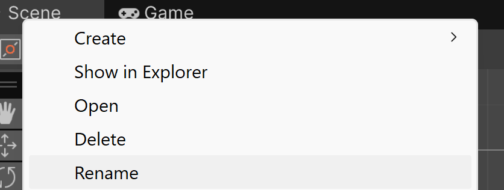
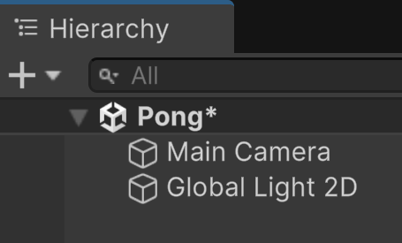
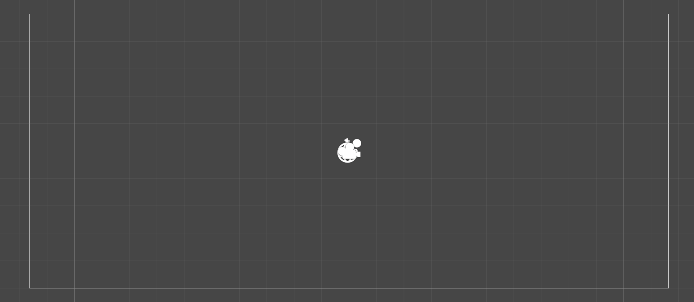
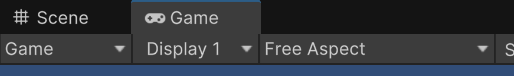
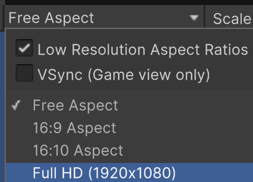
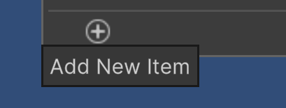
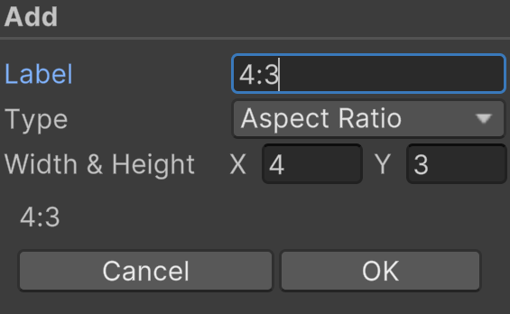
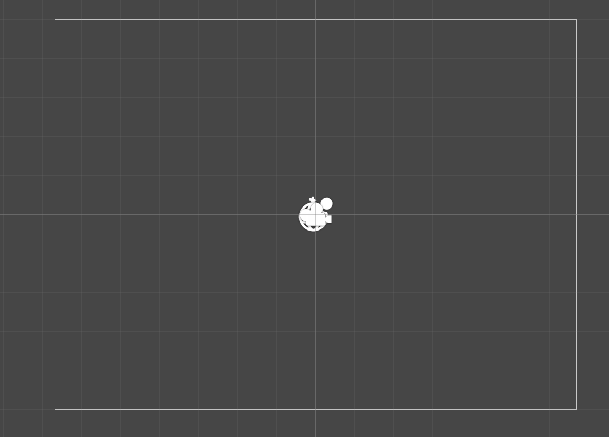

# Aspect Ratio

## First Steps
***
After you create a project in Unity, you're given a default scene (or level) named "SampleScene". Let's make that more descriptive so that we know what the level contains.

### Scene Rename
Inside of Unity at the bottom, you should see your project's file system.
* Goto Assets > Scenes.
* Right-click on the default scene file.
* Select "Rename" from the context menu.
    * 
* Rename the scene
    * I chose just "Pong" cause I'm super creative.

You should notice the name of the scene change in the Hierarchy view.

### Change Resolution

In the middle of the engine within the Scene tab, you can see a white square outlined. This represents our screen boundary. Since this is an important aspect to the game, let's change this to a set number.

Click on the Game tab that's located beside the Scene tab.

Then click on the dropdown menu that most-likely says "Free Aspect".

This is where we can set a resolution that we'd like to work with. Typically today content is authored for devices expecting to have a 16:9 or 16:10 aspect ratio,
but this wasn't the case when Pong was originally created. To help create that retro feel, we want to make this in a 4:3 aspect ratio. Looking through the list, you'll notice that's not an option.

That's okay. At the bottom there's a '+' symbol where we can add custom outputs.

Add a new item, and give it the values seen below. Then click OK.

You should now see the game area and boundary have a more square-like ratio.

Now let's make a "ball".

---
>Prev: [What Makes A Game?](/02_What/WHAT.md)  |  Next: [ Adding A Ball ](/04_Ball/BALL.md)
