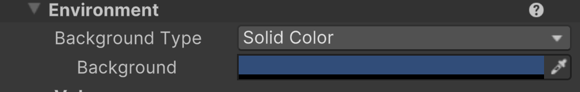

# Adding A Ball

Our goal here is to set up the background for our game and to get a representation of a ball bouncing off the screen boundaries.

## Save Your Project
***

If you haven't already, make sure you're saving your project. If you notice an asterisk by your scene name, it means you have changes that have yet to be saved.

## Change The Background Color
***

The game tab gives us the current view of our project as if we're playing the game. Currently, you'll notice that the background is its default color, a shade of blue.
We want it to be black to closer reflect the game that we're making.

To change it, select the "Main Camera" in your Hierarchy, left-side.
Now you should see the Main Camera's properties displayed in the Inspector panel on the right-hand side.

In its list of properties, you'll notice a category dropdown named "Environment". Click on it to expand what's available.

This is where the color of the background in the game is being set. Click on the band of blue beside "Background". This will open a color selection wheel. Click and drag down to the color black or you can manually enter the R,G, and B values of 0, which is pure black.

Now, while in the Game tab, you can see that we have a black background.

## Adding A "Ball"
***
You should now be back in the Scene tab.

Unity has a built-in way of creating basic assets, so we don't have to create everything from a separate program. Just about all 2D games are made from images that are referred to as a sprites.

>[!INFO]
> You can think of a sprite as any digital 2D image. As long as the image is made up of pixels, it's a sprite. We'll get a little more technical about this later on.

To replicate the ball from the original Pong, we need to add a white, square sprite to our game.
To do that, right-click in your Hierarchy. This gives us a context menu, which provides us with some common actions that we can access quickly.

From the context menu, select 2D Object > Sprites > Square

Now you should see a white square added to the game scene. You should also see a new object in the Hierarchy named "Square". Change the name from Square to Ball. You can do this in the Hierarchy or, with an object selected, in the Inspector panel.

## Testing Your Game
***

At any point, we can test our game. At the top-center you can see some buttons. Whenever you click on the play button, your game will launch so that you can see it in its current state, and you'll be automatically taken to the Game tab.
While your game is running, you can't make changes, but you can use it as a way of testing (more on this later).

You'll also see that the play button becomes a stop button. Press that to stop running the game.

If you run the game as is, you'll notice that it's just a static, white square on a black background, which is exactly what we made, so it's not wrong.

## Adding Motion
***

We need to tell Unity that our Ball is meant to move and not just be a static image. To do that we need to add a component to our Ball.

>[!INFO]
> Components in Unity add additional functionality to an object. You'll see that Unity has a number of built-in components.

Select the ball by clicking on it in the Hierarchy or in the scene. Now at the bottom of the Inspector panel you'll find a button named "Add Component".

When you click on that, you'll see all of Unity's built-in components. We want to add a 2D physics component named "Rigidbody 2D". 
You can find and select it in the component window by going to Physics 2D > Rigidbody 2D. Alternatively you can filter all the components by using the search bar in the component window.

Just be sure that you choose Rigidbody 2D, since Rigidbody is meant for 3D objects.
After you select it, you'll see through the Inspector panel that our Ball now has a Rigidbody 2D component.

>[!INFO]
> What's a Rigidbody Component do?
> "Adding a Rigidbody component to an object will put its motion under the control of Unity's physics engine. Even without adding any code, a Rigidbody object will be pulled downward by gravity..."
> 
> [Unity Documentation](https://docs.unity3d.com/6000.0/Documentation/ScriptReference/Rigidbody.html)

If you test your game again, by pressing the play button, you'll notice that the ball falls downward. 
That's great, but this isn't the behavior we want. Remember that the viewpoint of Pong is top-down, so falling downward is really more like rolling off the table.
To fix this we need to disable gravity on the Ball. 

If we go to the properties of our Ball, under the Rigidbody 2d component, you'll see Gravity Scale. This is how much the selected object is affected by the engine's gravity system. The value of 1 is meant to emulate natural Earth gravity.

We want to change that value to 0 in order to disable gravity on our ball.

After changing the value and playing the game again, you'll see that we're back to a static white square.

Next we'll look at adding a custom component (or a Script) to our ball in order to get it move how we'd like.

---
>Prev: Next: [Aspect Ratio](/03_Aspect/ASPECT.md)  |  Next: [Scripts](/05_Scripts/SCRIPTS.md)