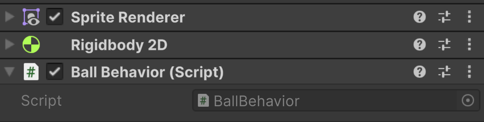

# Scripts
Scripts, in Unity, are how we add custom functionality to a game, and they can be used on just about everything to make it behave exactly how you'd like.

We'll be coding these scripts in C# (C Sharp). Things may be a little confusing at first, but we'll be going through each line added so that you can fully understand what's going on.

## Scripts Folder
***
An important part of game development is organization. This is especially true when working on a team.
Let's create a place where all of our scripts can live and can be easily found as needed.

In your Project folder view, you'll see a list of folders with "Assets" being at the top. The Assets folder is the root, or base, folder for your project. All other folders and items will go inside this folder
You'll see that Unity has created a couple of folders for us already, like "Scenes". We want to add another folder named Scripts.
To do this you can right-click on an empty area of the Assets folder and in the context menu go to Create > Folder

Change the name of the new folder to Scripts.

## Creating A New Script
***

Double-click on your scripts folder, and you shouldn't see anything (because it's an empty folder). We can verify we're in the correct place by looking at our directory.

We're currently in Assets > Scripts, so we're in the right place.

Right-click in the Scripts folder and select Create > MonoBehaviour Script

Rename that script to BallBehavior or another descriptive name of what the script does.

>[!Important]
> By naming conventions, you should always have a capital letter at the start of your script's name.

Before opening the script, let's make sure that we're set to use VSCode.

Using the top menu bar, go to Edit > Preferences. This will open the Preferences window.

In the Preferences window, select External Tools.

Then for External Script Editor, make sure that it's set to Visual Studio Code. If it's not, select it.

You can now close the Preferences window.

Now double-click on the BallBehavior script. This should launch VSCode.

When VSCode first launches, you may see a warning dialogue asking if you trust the code.
I chose to check that I trust all files within my Unity Projects folder so that I wouldn't have to do this for every project. Then click that I trust the authors, which is me in any case.

Now we can see a blank Unity script. It's not completely blank, as Unity has provided us with some default functions.

There's only a few lines of code here, so let's start off understanding what's going on.
But first, let's attach our script to our Ball.

## Adding Our Script to Our Ball
***
Back in Unity, make sure that the Ball is selected, and you can see its properties in the Inspector panel.
We can add our script like any other component. Scroll down and click on the Add Component button, and then search for your script's name.

After you click on it, you can see the script added to our Ball.

Now let's head over to VSCode, and take a look at our script.

---
>Prev: [Adding A Ball](/04_Ball/BALL.md)  |  Next: [Unity Script Basics](/06_Basics/BASICS.md)

