# Unity Script Basics

>[!NOTE]
> This documents approaches scripting with the assumption that you have no coding experience. Also because of this, all the code presented will come from a screenshot.
> This stops you from just being able to copy and paste the code into your project. When you're first learning coding or even a new coding language, it's important that you type everything out.

## Comments
***
One of the most important tools to someone learning how to code is making comments. Comments are completely ignored, and you can write whatever you'd like.
It has many uses, but the main one when starting out is note-taking. 

### // - Single Line Comment

To make a comment in C# you use two forward slashes (//) to comment out a single line of code.
If you're using VSCode, that line of code should turn green when commented out.
When starting out, I strongly suggest when you run across a bit of code that you're unsure how it works, use comments to help you break it down.

We can see some comments left for us in the new script that we created for our Ball.

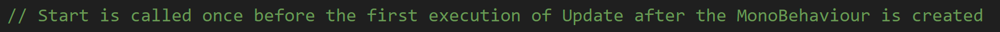

This is another common use for comments, which is relaying information to other coders. 

### /* */ - Block Comment

When you need to make many lines of comments, it's best to use a block comment (_/* */_). Block comments have a start marker (_/*_) and an end marker (_*/_). Any text within those markers will be a comment.

Here's an example:

 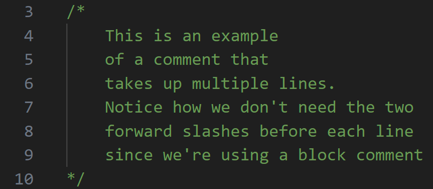

## Unity API
***

Some of the bits of code that you don't understand could be just basic coding blocks and statements that you're just not familiar with yet. Other times it could be something that's specific to Unity.

>[!NOTE]
> Even if someone was a C# master but never worked with Unity before, they'll still need to look things up that are specific to Unity.

Anything specific to Unity can be found in their API (application programming interface) documentation.
This is basically a document that tells you how to use all the things they've built out for the engine.
[You can find it here](https://docs.unity3d.com/6000.0/Documentation/ScriptReference/), but we'll look at how we can use it later on.

## Breaking Down Our Script
***
Let's analyze what Unity is providing us when we create a script. If you haven't done any programming, some of these concepts may seem strange or daunting. That's okay. 
I mainly want to expose you to these things now, and we'll continue to build upon them throughout the course. So it's okay if you don't fully grasp things at the moment.
***
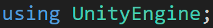

We'll come back to this one.

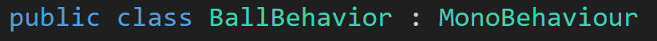

So you should notice one thing that's familiar in this line, the name that you gave your script. Let's look at the other keywords:

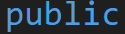

We'll talk  more about this later, but for now, think about it as a word that denotes access kind of like the real-world. 
If something is public, like a library or post office, everyone has access to it.
Now think about something that you own, such as your phone, that would be private, and may contain things that you don't want others to see or have access to.

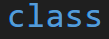

To not get too complicated, you can think of a class as a description of an object. Everything within a class defines how that object can operate. 
We'll cover this more later, but know that everytime you create a script in Unity, you're creating a new class.

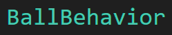

Nothing super special about this. It's just the name that we gave the script.

>[!Note]
> To stay with naming conventions, your script name should always start with a capital letter. You also want to make sure that the name of your script is descriptive of what it does or is for.
> This may mean that you need to use multiple words in your script name. When you do this, combine all the words with no spaces, and capitalize the first letter of each word. You can see this in my script named _BallBehavior_.
> When naming your scripts, try to be as descriptive as you can, while using as few words as you can. You don't want it to be crazy-long, such as _BallMovementAndOtherStuffRelatingToHowTheBallWillMove_.

>[!WARNING]
> Never change the name of your script. The name generated for you class, which is based on what you named your script, should always exactly match each other. Otherwise, you'll get errors, and things won't work.

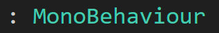

You don't have to worry too much about this. Just make sure you don't change it (unless told to). 

If you're curious as to what it means, basically it means that your class is inheriting from another class called _Monobehavior_. 
This gives us access to a bunch of stuff that the folks at Unity already put together to make working in their engine easier.

>[!INFO]
> MonoBehaviour is a base class that many Unity scripts derive from.
> MonoBehaviour offers life cycle functions that make it easier to develop with Unity.
> 
> [Unity Documentation](https://docs.unity3d.com/6000.0/Documentation/ScriptReference/MonoBehaviour.html)

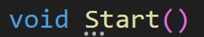
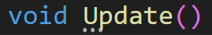

This is our first set of functions. A function is basically a named block of code. This will make more sense when we make custom functions later on, but for now, know that Start() and Update() are both special functions related to Unity.
Unity Engine handles how these functions operate. Also, function names must be unique, so we can't make another Start() or Update().

Start() only runs once, while Update() runs once every frame of the game. This means that if you're game is running at 60 frames per second (fps), Update() will run 60 times every second. Don't worry. We'll discuss this more later.

>[!NOTE]
> Depending on the language, you may see the term _function_ and _method_ used at different times, or you may not see the mention of a _method_ at all. Just know that they refer to the exact same concept.
> In a more traditional programming setting, _method_ is often used when explicitly referring to a function that resides inside a class. I'll most likely always refer to them as functions, but I wanted you
> to know in case you read or hear someone talk about _methods_.

Okay. Back to this. Know that this isn't super important for you to fully understand, I'm mainly explaining so we don't skip over anything.

Before I mentioned that both Start() and Update() are special to Unity. We didn't write them, right? But, they have to have come from somewhere. Let's see what happens when I comment out line 1:

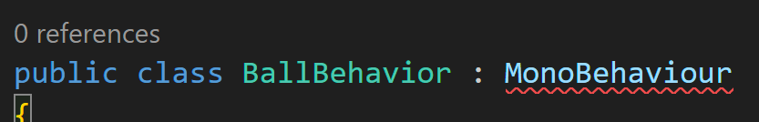

We get a red squiggle under _MonoBehaviour_. This means that an error has been found at this point. Basically VSCode has no idea where _MonoBehaviour_ is coming from because I commented out its _namespace_.

You can think of a namespace like the label on a container or the title of a book. It makes it much easier to combine different pieces of code that come from different places. Remember before when I mentioned that
function names have to be unique. If you think about it the words Start and Update are pretty common, and if I were to combine my code with someone else's who also contains functions named Start or Update, I'll end up
with a bunch of errors. You get around that by using namespaces. 

>[!TIP]
> Think of it this way. Let's say you're writing a research paper. Unless you're the main expert on the topic you're writing on, you're going to need to reference books on the material. Let's say you find some good stuff to write about in
> Chapter One of a book, but you've also written about the contents of Chapter One from another book (most books are going to have a Chapter One). To distinguish which Chapter One you're referring to, you include the title of the book.
> 
> This might be a bad illustration. I'll work on it as we go along. Or not.

So when we type _using UnityEngine;_, we're telling VSCode that we want to use the classes within the namespace UnityEngine, which includes MonoBehaviour. This lets VSCode know where to look.

> ---
>Prev: Next: [Scripts](/05_Scripts/SCRIPTS.md)  |  Next: [Scope](/07_Scope/SCOPE.md)