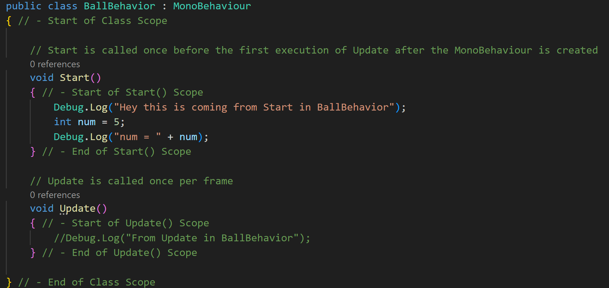

# Scope, Variables, And The Console
***

## Scope

Something important that we haven't talked about yet is the concept of _scope_ in programming. You can kind of think
of scope like a container and access system. I know this sounds familiar, but let's keep going.

In C# scope is marked by open and closed curly brackets.

>[!TIP]
> { is the beginning of a scope
> } is the end of a scope

In the code below you'll see that I've added some comments to note the start and end of our class's scope:

So all code within those curly brackets are inside (or in scope) to our class. Currently, that contains the Start() and
Update() functions. You'll also notice that functions also have a scope:

Anything that we want to happen inside of functions must be written within the scope of that function.

## The Console

The console is a coder's best friend. It's how you can get a peek into what's going on as the code is running (this is also known as debugging).
The console I'm referring to is back in Unity, but let's write some code so that we can see what's going on first.

Like I mentioned before, Start() only runs one time, so let's add some code within the scope of Start().
The command to write out to the console looks like this if we just want to write some text:

>Debug.Log("Some Message");

>[!WARNING]
> In C# you can think of the semicolon ( ; ) like the period of a sentence. It marks the end of a line of code. Now this 
> isn't an exact one to one, but know that if a semicolon is missing or in the wrong place, you'll get errors.
> 
> Also, errors are part of learning coding. Just make sure you understand what caused the error and how it was fixed.

So my Start() function now looks like this:

Before we can test it out, we need to save the script. You can do this by going to _File > Save_ or _File > Save All_ if you're
working on multiple scripts.

Now let's head back to Unity.

The first thing you may see is a message that scripts are compiling. Each time you save your scripts, Unity needs to 
recompile them in order to turn those lines of code into something that engine can use.

At the bottom beside our Project tab you'll see the Console tab. Click on that, and then click on the play button to run the game.
Since we attached the script to the Ball, which is in the scene, the script will run when we run the game.

You should see output in the console that looks like this:

You'll notice that when you stop the game, the console message stays until we play the game again, where it gets replaced.

Let's head back to VSCode so that we can examine the concept of scope.

## Scope Continued

Let's add a debug statement to Update():

If you save the script and run the game, the console will look like this:

I stopped it shortly after pressing play. All we see is the message from Update(), which is running 60 times every second.
On the top right section of the screenshot you can notice the message count, which means that Update() wrote 737 messages (minus one from Start()) in that short time.

## Variables and Types

In C# we have a several built-in types that we can use when creating variables. We need to make sure to use the correct type for the desired use-case of the variable.
Here are some common types available to us in Unity that we'll use when creating variables:

| Type Keyword | Name              | Use-Case                                       | Example                          |
|--------------|-------------------|------------------------------------------------|----------------------------------|
| bool         | boolean           | True / False values                   | 0 or 1 , true or false           |
| float        | floating number   | Decimal values                                 | -1.00, 0.00, 2.33, 236.989, etc. |
| int          | integer           | Whole number values        | -1, 0 , 4, -320, etc.            |
| string       | string of letters | Text values               | names, sentences, etc.           |

Let's create an integer named _num_ in the scope of Start(). Then let's set it equal to 5. That would look like this:

>[!NOTE]
> You'll notice that our variable name has yellow squiggle underneath. That doesn't mean that it's wrong. In fact,
> if you hover your mouse over the squiggle, you'll get a pop-up letting you know that we've created this variable
> but we haven't done anything with it.
> 
> 
> 

Let's print out to the console the value of _num_:

To do this we have our message in quotes, and then we're adding ( + ) the value of _num_ onto that message. 
Now I'm also going to comment out the Debug.Log line in Update(). Otherwise, it makes it harder to see the output that 
we want to see from Start(). My code currently looks like this:

If you were to save the script and then run the game, you'd see this in the console:

Now let's try to print out the same message using Debug.Log("num = " + num); in the Update function.

You'll notice that as soon as you add that code to Update(), this happens:

If you hover over the red squiggle, you'll see this message:

Basically what this is saying is that Update() has no idea what _num_ is, and that's because _num_ is not within the scope of Update().

>[!IMPORTANT]
> Previously I mentioned that functions must have unique names. This also applies to variable names **within the same scope**.

Because Update has no idea what _num_ is, I can actually create a new variable of the same name in Update().

Not only did I use the same variable name, but I also chose a different type. This is all valid code because each variable named _num_ exists within their respective scope.
This kind of variable would be referred to as a local variable.
For example, let's try to add another variable named _num_ inside of Update():

You'll see we get a red squiggle that when hovered over, lets us know that we already have another variable named _num_ in this scope.

Can we use the same variable across different functions in a class? Yes! There are a couple ways to do it, but we'll currently look at global scope.

## Global Scope
Contrary to a variable with local scope, meaning it's context only exists within the scope it was created, there's global scope. Variables with global scope exists in all 
levels of scope within the class. To create a global variable, you just need to create the variable within the top scope of the class, meaning not in any of the functions.
You can technically do this anywhere in the class, but normally you create global variables at the beginning of the class at the top. Let's create num in global scope:

When I do this, you can see that global variable is kind of grayed out, and when I hover over it, it tells me that the variable isn't being used. 
That's because each function is still using its local variable named num. Let's comment those lines out, so it looks like this:

Everything is still valid, but now each function is using the global variable _num_.

> ---
>Prev: [Unity Script Basics](/06_Basics/BASICS.md)  |  Next: [Ball Movement (Finally)](/08_Move/MOVE.md)