# Ball Movement (Finally)
***
Now that we've learned a little bit about the basics of writing scripts in Unity, let's look how we can get our ball moving.

## Rigidbody2D Component

First let's take a look at our Ball and its Rigidbody component.

>[!INFO]
> Remember that the Rigidbody component allows the Unity Engine to apply physics to objects with said component.

If we expand it, you should see something like this:

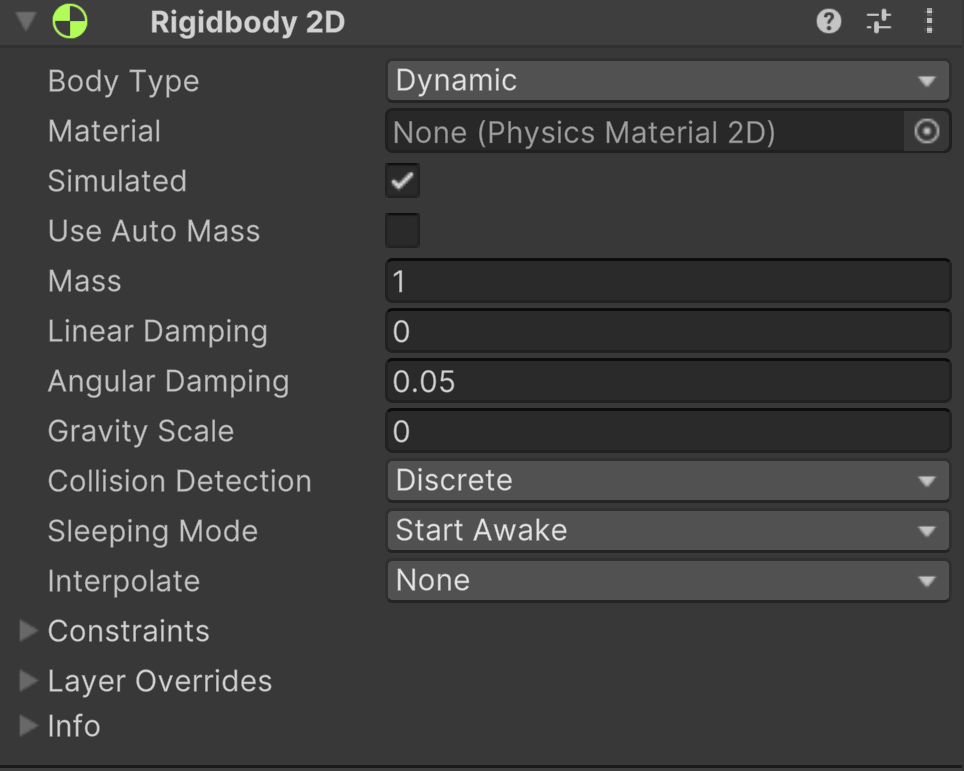

You'll notice that there a lot of different parameters that we can either type-in or select from a dropdown to help define how this Ball should be interpreted by Unity's physics.

Let's expand Info, at the bottom of the Rigidbody2D component:

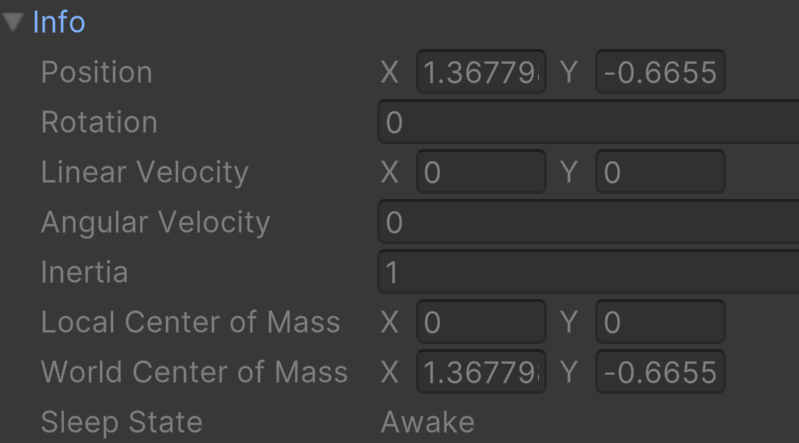

As you can see there are some additional properties, but we're not able to enter any values. One that would be nice is velocity, which controls how fast it's moving.
The good news is that, through scripts, we can access all of these properties. Also, instead of relying on hardcoded values (values that won't change) set in the Inspector panel, 
we can change anything we want while the game is running, and we can do this for all components.

What if I want the ball to get heavier or change speed? My script just needs to access a Rigidbody component.
What if I want the scale of an object to change? My script can be made to modify the Transform component.

Let's look at how we would do this.

## Modifying Rigidbody2D Via Script

First, I'm going to remove all the previous code and comments that were in the BallBehavior script. Feel free to do the same or just comment out the other lines.
So now I'm starting with this:

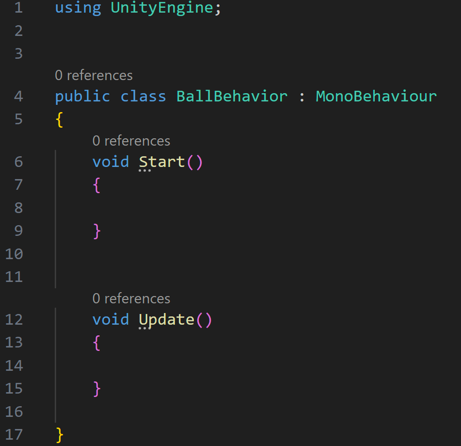

In order to work with a component, we need to make reference to it. To do this we create a variable of that type.
Remember that if I wanted to create a variable that would hold the type of a whole number, I would declare it by using the keyword _int_.
Unity has built-in the same concept for working with its own types, so to create a variable to hold a Rigidbody2D, we can use the keyword _Rigidbody2D_.

I also want to make sure that I can use this variable anywhere in my script, so I'm going to declare it in global scope.

As you type out your code, you'll notice that VSCode will try and give you context for things you might be trying to access. As soon as I type in "Ri", 
it already provides me with a list of possible choices, one being what I want.

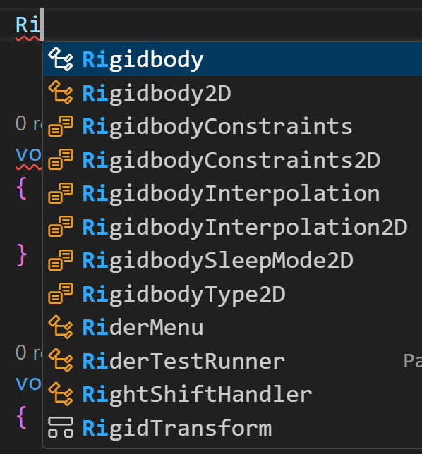

You can name your variable whatever you like, but you do want it to reflect what it's referring to. I'm calling mine "rb", as an abbreviation of Rigidbody.

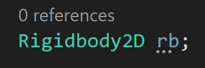

Let's go to Start() and try and get this ball moving. I'm first going to reference my variable by name "rb". I'm then going to follow that by a period.
After you type _rb._ you should see a new context menu.

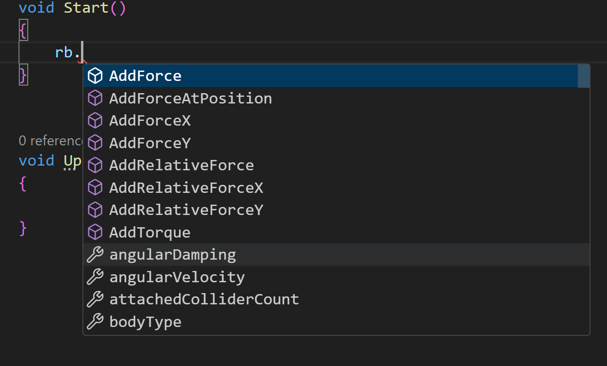

This list contains all the functions and properties associated with Rigidbody2D that we can use. You can scroll through the list and see that there's a lot there.
When looking at the list, you'll see symbols beside each line on the left. This tells you what kind of data that line is. There are mostly only two in Rigidbody2D, functions and properties.

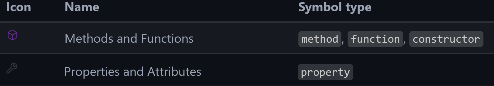

If you're interested or need future reference, [you can find documentation here](https://code.visualstudio.com/docs/editor/intellisense#_types-of-completions).

>[!INFO]
> The reason we can do this is that Rigidbody2D, and other types and components built by the Unity team, are classes. 
> They are, to an extent, the same as the class that we're working on right now. The big difference is the amount of code.
> 
> As mentioned before, classes are used to describe how an object works. Just like how we're writing a class to define 
> how our ball should work, Rigidbody2D is a class that describes how a Rigidbody2D should work.
> 
> To access those rules and properties of a class, we create a variable to reference the class, and then we can use a 
> dot modifier (a period) followed by the function or property we want to use.

As previously mentioned, velocity controls how fast our object is moving, so let's start typing "velocity" after "rb.":

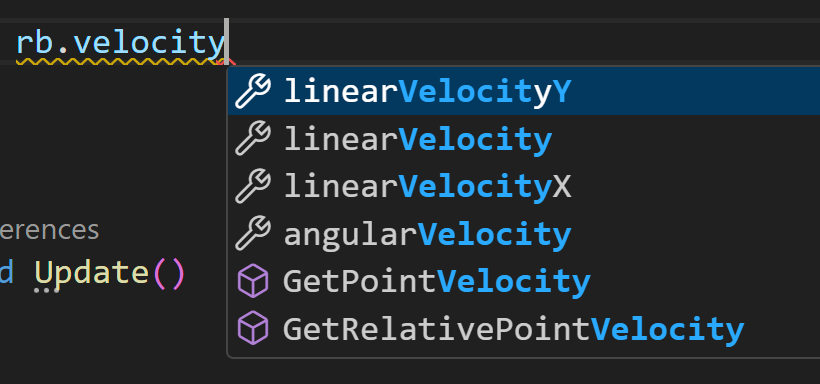

As you can see, we have a few options we can choose from. How do we know which one to use?

## Back To Unity's API
We talked a little about Unity's API before, but now we've covered enough material to see how we can use it.

[Head here to follow along.](https://docs.unity3d.com/6000.0/Documentation/ScriptReference/)

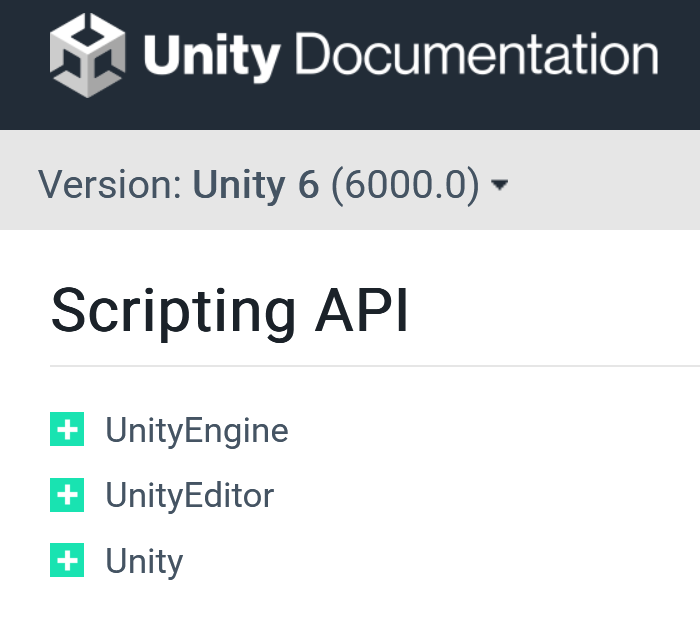

First thing is that you always want to make sure you are on the correct version number. We're using Unity 6.0 and the documentation is for the same version.
We can tell by looking in the top-left corner. If we were working with a newer or older version of Unity, we could select the version from the dropdown.

>[!NOTE]
> This is important because code changes over time, which leads to how something may have worked in a previous version not working in the current version.
> This isn't something you usually have to worry about as an end-user. Normally you just download the latest version of the software or game and carry on as normal.
> But if you're coding the games or software, this is something you always have to be mindful of.

If you look at the categories on the left, does anything look familiar? Remember line 1 of our class, "using UnityEngine"?
The category _UnityEngine_ contains most of what you'll need when working on scripts. If you expand it, you'll see a list of sub-categories.

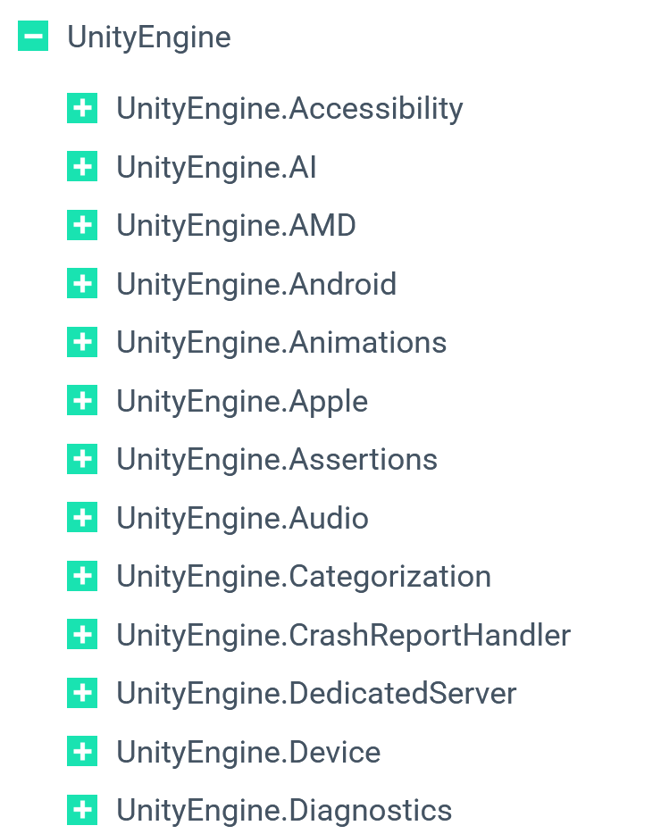

We can scroll down and skip over most of these. Remember when I mentioned that Rigidbody2D was a class built and included in Unity? Well there's a "Classes" sub-category, so let's expand that.

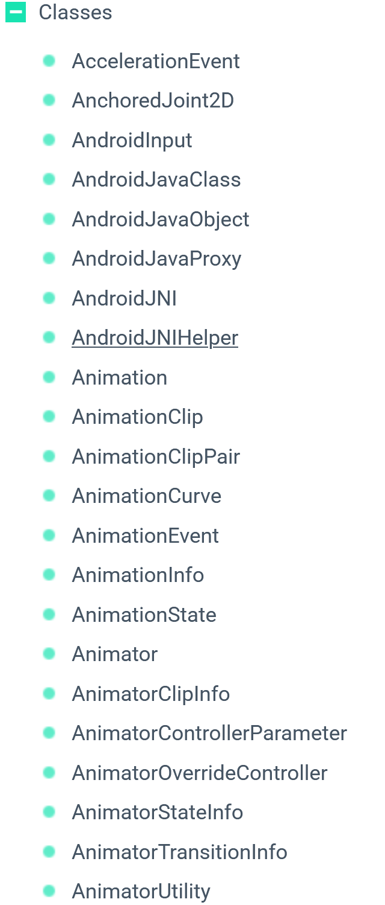

Now we can see an alphabetical list of every class that Unity has given us access to. If you scroll down, you'll see Rigidbody2D. Click on it.

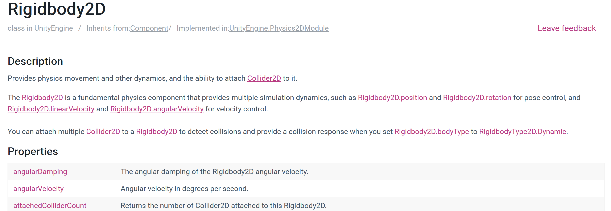

Now we're given a description on what a Rigidbody2D is used for, as well as list and description of all associated properties and functions.

If we scroll down the property list, we'll find our linearVelocity options.

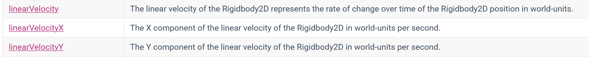

If we click on "linearVelocity", we're taken a step further.

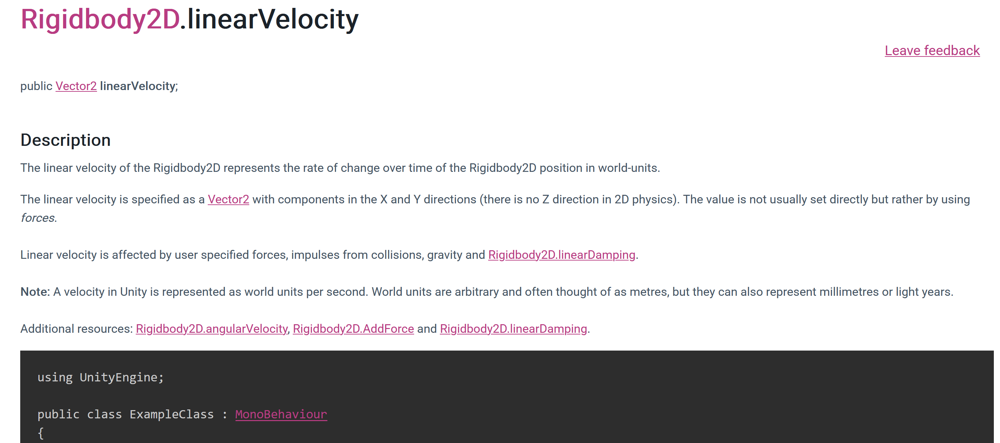

Now we can see a more robust description of what this property does, links to other associated properties we might want to look at, and example code on how you could use the property.

>[!TIP]
> Unity's API documentation is an amazing resource when you're just starting out or need to look up something you haven't done yet.

It looks like linearVelocity is what we want to use. It will allow us to have control of our ball's velocity in both the X and Y directions at the same time.

## Changing Velocity

So now we know that we want to change _rb.linearVelocity_, but what do we change it to? In the API it says that _linearVelocity_ stores the value of a Vector2.

>[!INFO]
> You don't _have_ to know this, but I want the information available to you, so you can understand what's going on.
> 
> A **vector** is a quantity, such as velocity, completely specified by a magnitude and a direction.
> The **magnitude** of a vector is defined as the length of the vector.
> 
> A Vector2D would contain the level of magnitude in both the x and y directions.
> A Vector3D contains the level of magnitude in x, y, and z directions.

Let's start out by actually moving in just one direction. Let's have our cube move up in just the Y direction. We can do that by using _rb.linearVelocityY_.
If you hover over _linearVelocityY_, you'll see that the value of _linearVelocityY_ is expected to be a float (decimal value). You could also find this information
by looking it up in the API.

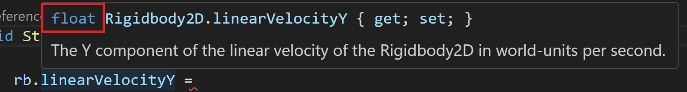

Let's set it so that we're applying a vector of 0.5 in the Y direction.

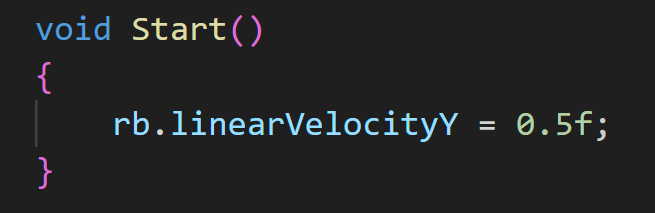

>[!INFO]
> When working with floats in C#, you have to follow your number value with the letter 'f'.
> That's the main thing you should remember for now. 
> 
> If you want the actual reason, it's that if you don't include the 'f', the
> variable will get created as a type named _double_. A _double_ and a _float_ are used the same way (to store decimal value numbers), 
> but a _double_ allows you to be more precise (it can hold bigger numbers with more decimal places). The downside to using a 
> _double_ over a _float_ is that it takes up more computer memory, which can eventually slow down a program or even your computer.
> We don't need that level of precision, so we're fine to use _floats_.

Save your script, head back to Unity, and press play.

## Error

Unfortunately, you'll notice that the ball still isn't moving, In fact, if you look at the console, you'll see there's an error:

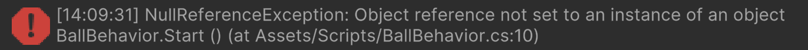

What does this mean? Essentially in our code, we told it that we want to work with a Rigidbody2D component, but we never told which one.

We could have 1,000 objects in our scene, and each one could have a Rigidbody2D component. That's why Unity needs us to specify the object we're talking about.

There are two ways we can do this.

## GetComponent

One way of doing this is the GetComponent function. Inside of Start(), we can do the following:

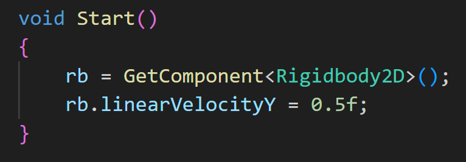

GetComponent gets reference to the name of the component specified between "<" and ">". It looks at whatever the 
object is that our script is attached to, in this case our Ball.

When we say that rb is equal to GetComponent<Rigidbody2D>(), we are saying rb references the Rigidbody2D component
currently attached to our Ball.

Now if you save your script and play the game in Unity, you'll notice that our ball is actually moving!

## Exposing Variables

Another way that we can do this is by exposing our rb variable to the editor. You'll see what I mean in a second.

By default, when we created variables in a class they are created as private variables. This is good coding practice, since
you want to choose what is made public. In order to make a variable public, we can use the public keyword before the declaration.
Doing so makes my code look like this:

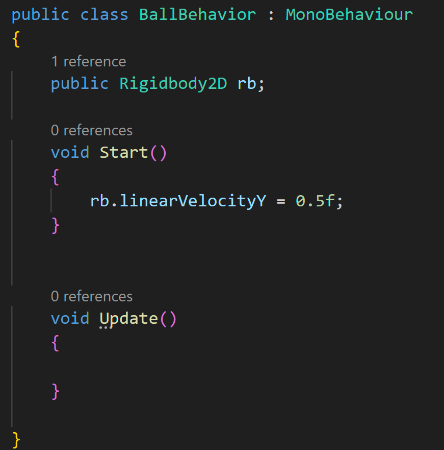

Save the script and head to Unity. Click on the Ball, and look at the Inspector panel. If you look at our script component, you'll see there's something new.

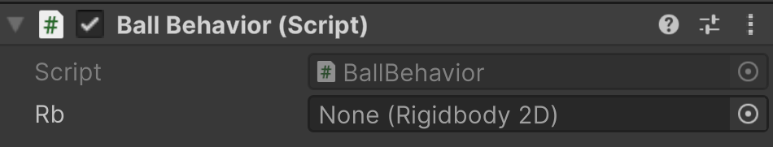

When you make a variable public in Unity it also exposes that variable to the Inspector panel. This is extremely helpful and something that we'll use often.
In order to assign a value to Rb, you can drag and drop the rigidbody2D component in the Ball to that area. Then it should look like this:

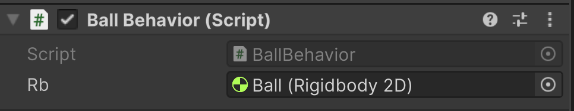

This shows us explicitly that we're using the Rigidbody2D component from our Ball object.

Now if you press play, you should see the same behavior as the other method.

## Adding Some Speed

Back in VSCode, let's create a variable named speed so that we can play with how fast our ball is moving. It should look like this:

Save and head back to Unity. You should notice that now we have access to the speed variable. We gave it a default value of 0.5, but we can change that in the editor.
This makes a good way to figure out what a good starting speed would be. Let's change the value to 1.

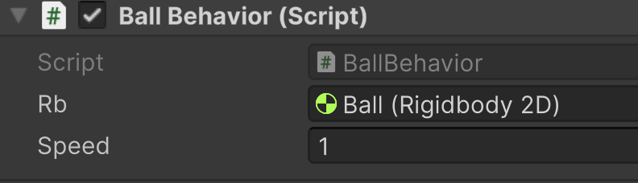

Now test it out. The value only gets applied when we first start the game, so to test out different values, you'll need to stop and play the game each time.

> ---
>Prev: [Scope](/07_Scope/SCOPE.md)