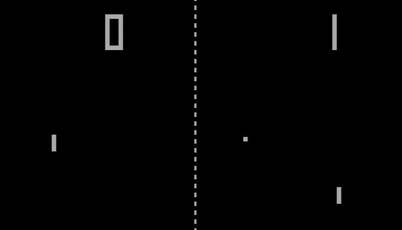

# Video Game Prototyping With Unity - _Pong_

We're going to start our journey examining a game that helped shape the view of video games from both a consumer and business standpoint.
_Pong_ wasn't the first computer game to exist, but it was the first commercially successful video game. 
We're going to examine visuals and mechanics of the game and recreate parts of the game. 
Then we'll look at how we can extend the concepts of the simple game into something more modern.

>[!TIP]
> Play [this version of _Pong_](https://www.primarygames.com/arcade/classic/pongclassic/) to get an idea of what the game play is like.

### Contents
***
* [Project Setup](/01_Setup/SETUP.md)
* [What Makes A Game?](/02_What/WHAT.md)
* [Aspect Ratio](/03_Aspect/ASPECT.md)
* [Adding A Ball](/04_Ball/BALL.md)
* [Scripts](/05_Scripts/SCRIPTS.md)
* [Unity Script Basics](/06_Basics/BASICS.md)
* [Scope](/07_Scope/SCOPE.md)

---
>Next: [Project Setup](/01_Setup/SETUP.md)
